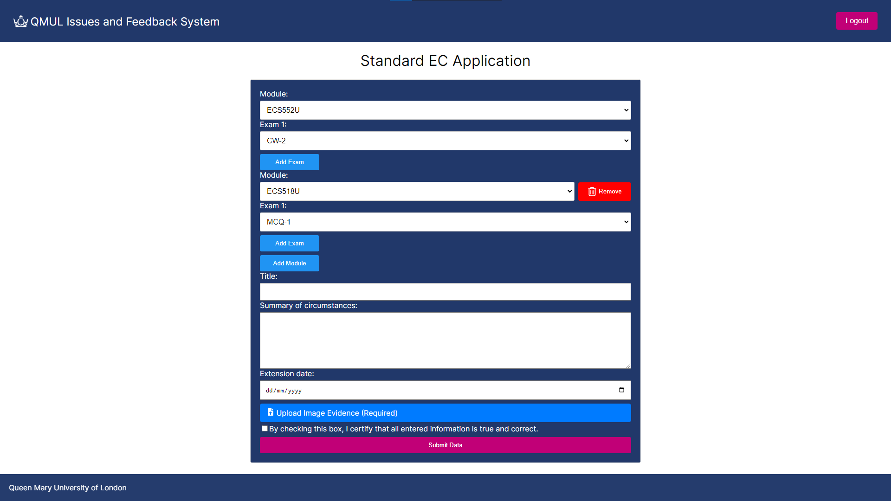
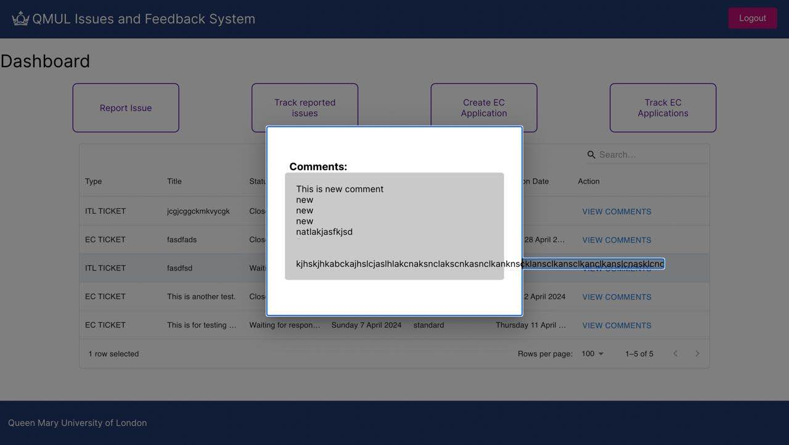

# QMUL Internal Issues & Feedback System

An internal demo prototype built by a team of six to streamline **deadline extension requests** and **issue reporting** for our department’s student cohort. The system was designed to replace the tedious online EC forms with a more linear, straightforward process. While developed as a prototype, it was designed to scale to **500+ users**, supporting both students and staff.

---

## ✨ Features
- Student‑friendly interface for submitting deadline extension requests and reporting issues  
- Authentication with **student, staff, and admin roles**  
- Tickets could be escalated across departments and tracked through different states  
- Automated faculty notifications for new extension requests  
- Centralised issue tracking accessible to staff and administrators  
- Fully accessible design with high‑contrast fonts and semantic HTML for screen readers  

---

## 🚀 Tech Stack
- **Frontend:** React  
- **Backend:** Supabase + PostgreSQL  
- **Collaboration:** Agile Scrum (6‑person team)  
- **CI/CD:** GitHub workflows for continuous integration and delivery  

---

## 📸 Screenshots
- **Deadline Extension Form**  
  

- **Issue Comment / Dashboard View**  
  

---

## 👤 My Role
- Took on the role of **project lead**, coordinating a six‑person team and ensuring smooth delivery through Scrum sprints and Agile practices  
- Guided teammates new to React and Supabase with onboarding guides, workshops, and ongoing support  
- Oversaw **code quality, accessibility standards, and semantic HTML syntax**, ensuring the system was fully usable across devices and screen readers  
- Directed CI/CD setup and maintained a consistent development workflow  
- Led iterative user testing and feedback cycles to refine usability and align with student and staff needs  
- Personally developed the **deadline extension system**, including form submission, validation, and backend triggers for faculty notifications  

---

## 📌 Notes
This project was developed as part of an internal university system.  
The code cannot be shared publicly, as it was created within a private university repository.  
